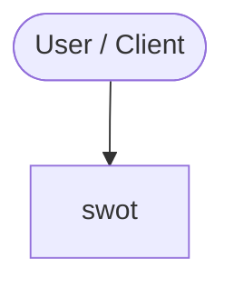

# Context Map — `swot`

> Auto-generated architecture & deployment context map. Summarizes the core application, container/cloud footprint, and database connections. Regenerate after significant structural changes.

**Repo:** `avnit/swot` · **Fork** · Public · Primary language: Kotlin · Default branch: `master` · Files: 26853

**Description:** Identify email addresses or domains names that belong to colleges or universities. Help automate the process of approving or rejecting academic discounts.

## 1. Core application

## 2. Containers & cloud applications

_No container, Kubernetes, IaC, or cloud-deploy manifests detected. Runs as a local script/library or static site._

## 3. Database connections

_No database drivers or connection strings detected._

## 4. Architecture diagram

## 5. Security posture

- No open Dependabot alerts or static-scan findings recorded.

---
_Generated by repo context-mapping pass on 2026-08-13._